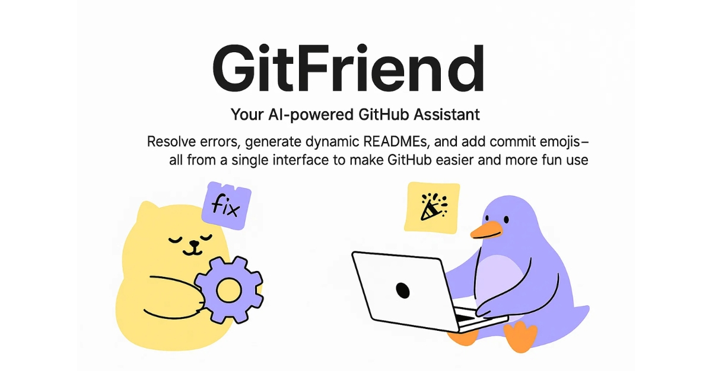

# Git-Friend <p align="center">
  <a href="https://www.producthunt.com/posts/git-friend?embed=true&utm_source=badge-featured&utm_medium=badge&utm_source=badge-git&#0045;friend" target="_blank">
    
  </a>
</p>

<!-- <p align="center">
  <a href="https://www.producthunt.com/posts/git-friend?embed=true&utm_source=badge-featured&utm_medium=badge&utm_source=badge-git&#0045;friend" target="_blank">
    
  </a>
</p> -->

<p align="center">
  
</p>
<p align="center">
  
  
</p>


Welcome to GitFriend! 🎉
Your AI-powered GitHub assistant, designed to make managing your repositories easier and more efficient than ever before.


## About 📚

### About GitFriend 📚  
GitFriend is a cutting-edge tool built with React, TypeScript, and AI technology to enhance your GitHub experience. Whether you're a developer, project manager, or beginner, GitFriend helps you navigate GitHub with ease, offering features that save you time and improve productivity.

With GitFriend, you can access a variety of powerful tools right at your fingertips:  
- **AI Chat for GitHub Help**: Encountering issues or need guidance? Chat with GitFriend's AI to resolve errors or learn Git and GitHub concepts quickly.  
- **Dynamic README Generation**: Automatically generate customized README files for your repositories with just a few clicks.  
- **Commit Emojis**: Add fun and meaningful emojis to your Git commits to improve readability and make your commit history stand out.

GitFriend simplifies your GitHub workflows and allows you to focus on what matters most: your projects.

## Current Features 🚀

- **Google Authentication**: Securely log in using your Google account to access all features.
- **AI Chat Integration**: Get assistance with Git commands, project setup, and more through our integrated AI chat.
- **README Generation**: Automatically generate professional READMEs for your projects with customizable templates.
- **Gitmoji Support**: Easily add expressive emojis to your commit messages following the Gitmoji convention.
- **User-friendly Interface**: Intuitive UI that makes navigation and usage a breeze.
- **React Components**: Utilizes various React components for interactive and responsive user experience.

## 🗺️ Roadmap

We're constantly working to improve Git-Friend. Here are some features we're planning to add:

- [ ] **GitHub OAuth Integration**: Connect directly to your GitHub account to access repositories and more.
- [ ] **One-Click README Updates**: Push generated READMEs directly to your repositories without leaving the app.
- [ ] **Enhanced README Customization**: Add badges, images, and custom sections to your READMEs.
- [ ] **Custom Prompt Templates**: Save and reuse custom prompts for AI-generated content.
- [ ] **GitHub Activity Dashboard**: Track and visualize your GitHub activity.
- [ ] **Badges In readme**: there will be    this 
- [ ] **Star History** : Github repo star history 
<!-- 
<a href="https://www.star-history.com/#krishn404/Git-Friend&Timeline">
 <picture>
   <source media="(prefers-color-scheme: dark)" srcset="https://api.star-history.com/svg?repos=krishn404/Git-Friend&type=Timeline&theme=dark" />
   <source media="(prefers-color-scheme: light)" srcset="https://api.star-history.com/svg?repos=krishn404/Git-Friend&type=Timeline" />
   
 </picture>
</a> -->
.

## Tech Stack 💻

- **Programming Languages**: TypeScript, CSS, JavaScript
- **Frameworks/Libraries**: React, Next.js, Octokit, Radix UI, Firebase, TailwindCSS
- **Development Tools**: Node, npm, TypeScript
- **AI Integration**: Groq

## Getting Started 🛠️

### Prerequisites

Before you can run Git-Friend on your local machine, make sure you have:
- Node.js (v16 or later)
- npm (v8 or later)
- A Google account for authentication
- Various API keys (see environment setup below)

### Installation

1. Clone the repository:
```bash
git clone https://github.com/krishn404/Git-Friend.git
```

2. Navigate into the project directory:
```bash
cd Git-Friend
```

3. Install the dependencies:
```bash
npm install

```
> ⚠️ **Note:** If you encounter dependency errors during installation, try running the following command:
>
> ```bash
> npm install --legacy-peer-deps
> ```

## 4 🔐 Environment Variables Setup

Before running Git-Friend locally, make sure to configure the following environment variables in a `.env.local` file at the root of your project:

<details>
<summary> 🔥 Firebase Configuration</summary>

```env
NEXT_PUBLIC_FIREBASE_API_KEY=your_firebase_api_key
NEXT_PUBLIC_FIREBASE_AUTH_DOMAIN=your_firebase_auth_domain
NEXT_PUBLIC_FIREBASE_PROJECT_ID=your_firebase_project_id
NEXT_PUBLIC_FIREBASE_STORAGE_BUCKET=your_firebase_storage_bucket
NEXT_PUBLIC_FIREBASE_MESSAGING_SENDER_ID=your_firebase_messaging_sender_id
NEXT_PUBLIC_FIREBASE_APP_ID=your_firebase_app_id
FIREBASE_PRIVATE_KEY=your_firebase_private_key
FIREBASE_CLIENT_EMAIL=your_firebase_client_email
```
</details>

<details>
<summary> Other Configuration</summary>

```env
GITHUB_ACCESS_TOKEN=your_github_access_token
GROQ_API_KEY=your_groq_api_key
UPSTASH_REDIS_REST_TOKEN=your_upstash_redis_token
UPSTASH_REDIS_REST_URL=your_upstash_redis_url
```
</details>

5. Start the development server:
```bash
npm run dev
```

Now, you can access Git-Friend at `http://localhost:3000`.

## User flow

### Login
1. Navigate to the homepage and click on "Login with Google"
2. Complete the Google authentication flow
3. You'll be redirected to the dashboard upon successful login

### Using the README Generator
1. From the dashboard, select "README Generator"
2. Enter your project details (name, description, tech stack)
3. Customize the sections you want to include
4. Click "Generate README"
5. Preview the generated README and make any needed adjustments
6. Download the README or copy to clipboard

### Using the AI Chat
1. Navigate to the "AI Chat" section
2. Type your question about Git or GitHub
3. Receive instant AI-powered assistance

### Using Gitmoji
1. Go to the "Gitmoji" section from the dashboard
2. Browse through available emojis categorized by commit type
3. Click on an emoji to copy the corresponding code
4. Use in your commit messages for semantic versioning

## Use Cases 📋

### For Open Source Contributors
Use Git-Friend to quickly generate professional READMEs for your open source projects, making them more accessible to potential contributors.

### For Team Leads
Maintain consistency across your team's repositories by using standardized README templates and commit message practices with Gitmoji.

### For GitHub Beginners
Get assistance with Git commands and best practices through the AI chat feature.

### For Documentation Teams
Streamline the process of creating and updating documentation with AI-powered README generation and formatting.


# Contributing Guidelines

Thank you for considering contributing to this project! To keep things organized and collaborative, please follow the steps below when contributing:

---

## 🐛 Reporting Issues & Proposing Features

Before starting any work, contributors **must raise an issue** and follow the issue template.

### ✅ Issue Template

When creating an issue, please include the following:

* **Title**: Concise summary (e.g., `Fix broken login redirect`)
* **Type**: Bug report / Feature request / Improvement
* **Description**:

  * What is the bug, error, or issue?
  * Where did you encounter it?
  * Any relevant logs, screenshots, or screen recordings?
* **Proposed Solution**:

  * How do you plan to fix or implement it?
  * Any tools, libraries, or dependencies you intend to use?

Once the issue is created, a maintainer will review it.

---

## 📝 Getting Assigned

🚫 **Do NOT start working on any issue unless it has been assigned to you by a maintainer.**

To get assigned:

1. Raise a clear and descriptive issue using the template above.
2. Comment: `I would like to work on this`.
3. Wait for a maintainer to review and assign the issue to you.

Only after assignment should you begin working on your contribution.

---

## 🔧 Development Workflow

1. **Fork** this repository.
2. **Clone** your fork locally:

   ```bash
   git clone https://github.com/krishn404/Git-Friend.git
   cd your-repo-name
   ```
3. Create a new branch:

   ```bash
   git checkout -b fix/your-issue-title
   ```
4. Make your changes with clear and meaningful commits.
5. Ensure all tests and linters pass.
6. Push your branch and open a Pull Request referencing the issue number.

---

Thanks for helping improve this project! 🚀 and Feel free to ask questions by commenting on issues or reaching out directly on my  [mail](mailto:maharshikrishnakant@gmail.com)